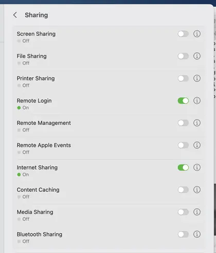
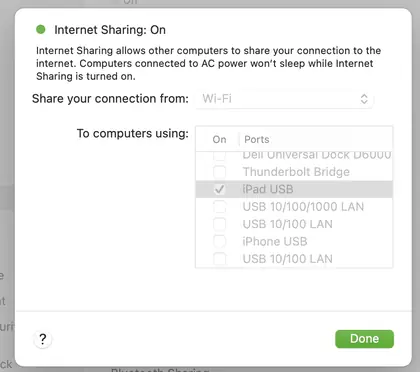
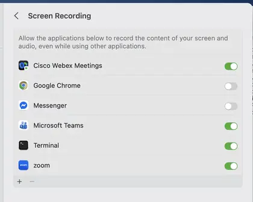
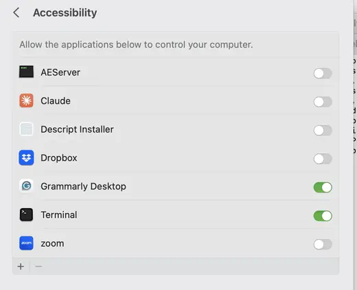
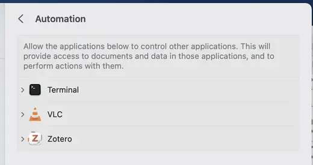

# Visual setup walkthrough

Use this after the fresh-Mac bootstrap has finished. It covers the manual macOS and iPad steps that cannot be granted automatically.

## 1. Connect and trust the iPad

Connect the iPad to the Mac with a USB data cable. If either device asks whether to trust or allow the connection, approve it.

## 2. Enable Internet Sharing to the iPad USB link

On the Mac, open **System Settings → General → Sharing**.



Open the details for **Internet Sharing**, then set:

- **Share your connection from:** `Wi-Fi`
- **To computers using:** turn on `iPad USB` (some systems may label the device `iPhone USB`)
- turn **Internet Sharing** on, then click **Done**



Confirm the private USB network is present:

```bash
~/ipad-display/scripts/ipad doctor
```

The network check should report `192.168.2.1` as present before starting the display.

## 3. Grant Screen Recording for display capture

Run the display once so macOS registers a Screen Recording request:

```bash
ipad
```

Then open **System Settings → Privacy & Security → Screen Recording**. For the normal Terminal-launched install, enable **Terminal**. If you launch the project from iTerm2, another terminal, or an IDE instead, enable the application macOS lists for that launch path.

Do not wait for a specifically named `iPad Display`, Electron, DeskPad, Deskreen CE, or `MacUsbDisplay` entry if macOS attributes the request to Terminal. After changing the permission, quit/restart the requesting application if macOS asks, then start `ipad` again.



## 4. Open the viewer on the iPad

With `ipad` running, open this address in iPad Safari:

```text
http://192.168.2.1:3131/
```

For the normal full-screen workflow, tap Safari's **Share** button, choose **Add to Home Screen**, add it, then launch the saved Home Screen viewer.


Screenshot source: [Checkie](https://checkie.org/).

When display-only mode is working, stop it before testing touch:

```bash
ipad stop
```

## 5. Grant Accessibility for touch mode

Start touch mode once:

```bash
ipad touch
```

Open **System Settings → Privacy & Security → Accessibility**. For the normal Terminal workflow, enable **Terminal**. If macOS instead lists another terminal or IDE you used to launch it, enable that listed requester.

Restart `ipad touch` if macOS asks you to restart the requesting process after granting permission.



Three-finger Mission Control or Spaces gestures may also trigger an **Automation** permission request. If that happens, open **System Settings → Privacy & Security → Automation** and expand **Terminal**. Approve the application macOS actually asks Terminal to control.

The Automation list is populated from previous permission requests, so do not look for a fixed `System Events` entry. The screenshot below shows where Terminal appears; the child entries on another Mac can differ.



## 6. Final checks

Display-only:

```bash
ipad
ipad status
ipad stop
```

Touch:

```bash
ipad touch
ipad status
ipad touch stop
```

Finally run:

```bash
~/ipad-display/scripts/ipad doctor
```

Plain `ipad` is always display-only. Touch control is enabled only by the explicit `ipad touch` command.
