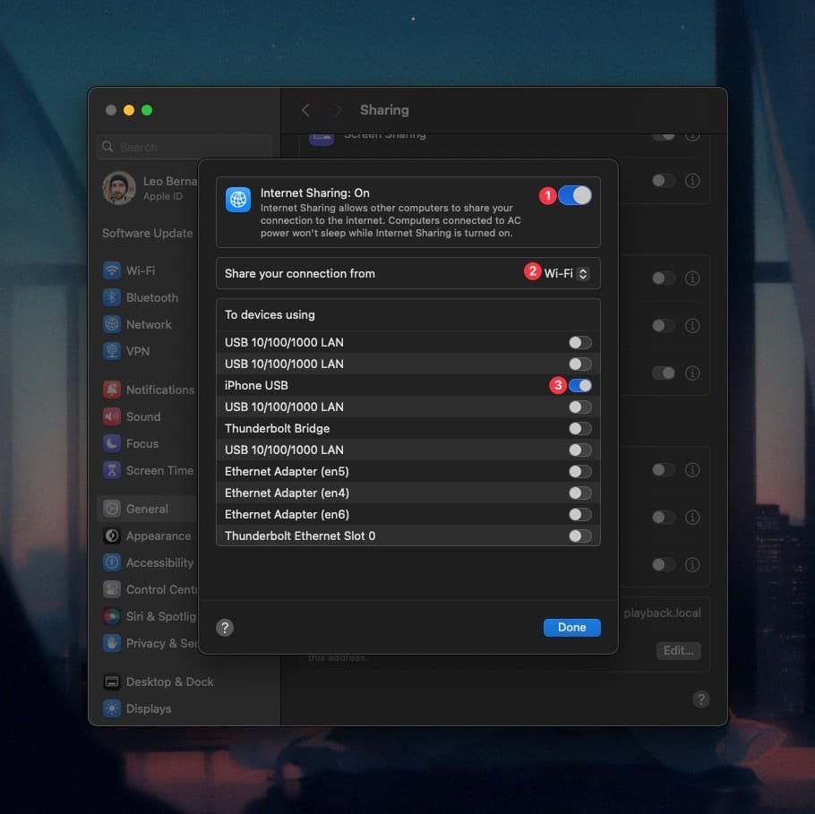
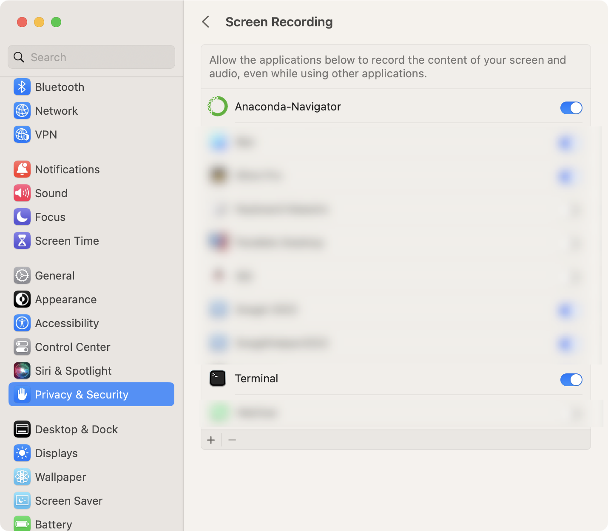
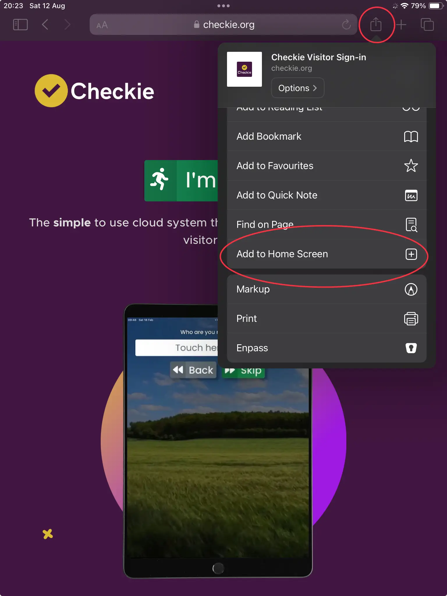
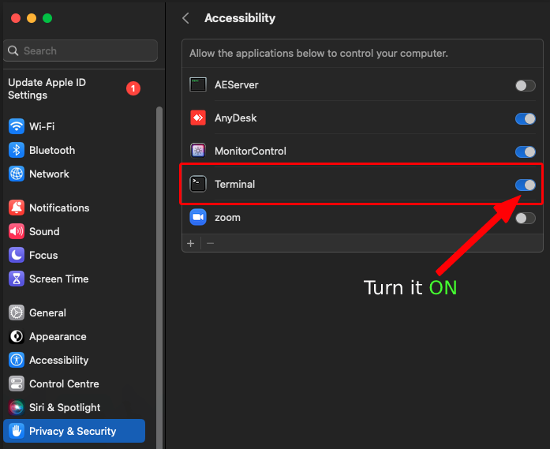

# Visual setup walkthrough

Use this after the fresh-Mac bootstrap has finished. It covers the manual macOS and iPad steps that cannot be granted automatically.

## 1. Connect and trust the iPad

Connect the iPad to the Mac with a USB data cable. If either device asks whether to trust or allow the connection, approve it.

## 2. Enable Internet Sharing to the iPad USB link

On the Mac, open **System Settings → General → Sharing**, then open the details for **Internet Sharing**.

Set:

- **Share your connection from:** `Wi-Fi`
- **To devices using:** turn on `iPad USB` (some systems may label the device `iPhone USB`)
- turn **Internet Sharing** on, then click **Done**



Screenshot source: [AbleSet — Connecting to AbleSet From Other Devices](https://beta.ableset.com/docs/network).

Confirm the private USB network is present:

```bash
~/ipad-display/scripts/ipad doctor
```

The network check should report `192.168.2.1` as present before starting the display.

## 3. Grant Screen Recording for display capture

Run the display once so macOS registers a Screen Recording request:

```bash
ipad
```

Then open **System Settings → Privacy & Security → Screen Recording**. For the normal Terminal-launched install, macOS may attribute the request to **Terminal** rather than showing an `iPad Display` or Electron entry. Enable **Terminal** when that is the requester shown. If you launch the project from iTerm2, another terminal, or an IDE instead, enable the application macOS lists for that launch path.

Do not wait for a specifically named `iPad Display` entry if macOS has already listed Terminal. After changing the permission, quit/restart the requesting application if macOS asks, then start `ipad` again.



Screenshot source: [CNBlogs — macOS Screen Recording settings example](https://www.cnblogs.com/ZJT7098/p/17695865.html).

## 4. Open the viewer on the iPad

With `ipad` running, open this address in iPad Safari:

```text
http://192.168.2.1:3131/
```

For the normal full-screen workflow, tap Safari's **Share** button, choose **Add to Home Screen**, add it, then launch the saved Home Screen viewer.



Screenshot source: [Checkie](https://checkie.org/).

When display-only mode is working, stop it before testing touch:

```bash
ipad stop
```

## 5. Grant Accessibility for touch mode

Start touch mode once:

```bash
ipad touch
```

Open **System Settings → Privacy & Security → Accessibility**. As with Screen Recording, a helper launched from the command line can be attributed to the terminal application that launched it. For the normal Terminal workflow, enable **Terminal** when that is the entry macOS presents. If macOS instead lists the helper itself or another terminal/IDE you used to launch it, enable that listed requester.

Restart `ipad touch` if macOS asks you to restart the requesting process after granting permission.



Screenshot source: [Stack Overflow — Terminal Accessibility example](https://stackoverflow.com/questions/53103394/robot-mousemove-does-not-work-at-all-in-mac-os-x).

The first three-finger Mission Control or Spaces gesture may also make macOS ask whether the requester may control **System Events**. Approve that Automation request if it appears.

## 6. Final checks

Display-only:

```bash
ipad
ipad status
ipad stop
```

Touch:

```bash
ipad touch
ipad status
ipad touch stop
```

Finally run:

```bash
~/ipad-display/scripts/ipad doctor
```

Plain `ipad` is always display-only. Touch control is enabled only by the explicit `ipad touch` command.
